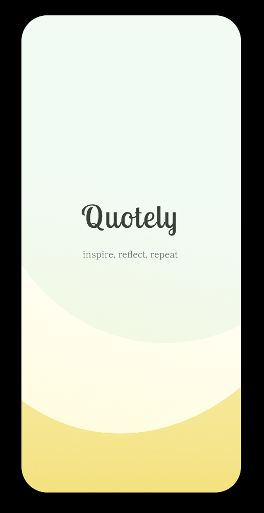
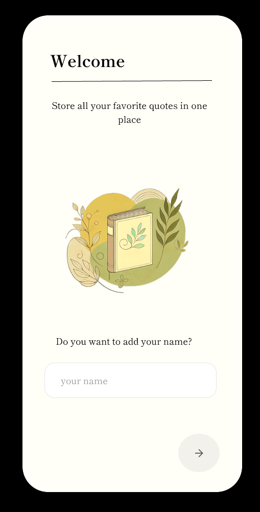

# Quotably

A React Native application built with Expo that allows users to store, update, and edit their favorite quotes. The app utilizes React Navigation for seamless navigation between screens and Async Storage for persistent local storage.

## Features

- **Store Quotes:** Save your favorite quotes to the app.
- **Update Quotes:** Edit and update existing quotes.
- **Delete Quotes:** Remove quotes you no longer want to keep.
- **Persisted Storage:** Quotes are saved locally on the device using Async Storage, so they persist between sessions.

## Technologies Used

- [Expo](https://expo.dev/): A framework and platform for universal React applications.
- [React Native](https://reactnative.dev/): A framework for building native apps using React.
- [React Navigation](https://reactnavigation.org/): Routing and navigation for your React Native applications.
- [Async Storage](https://react-native-async-storage.github.io/async-storage/): A simple, unencrypted, asynchronous, persistent, key-value storage system for React Native.

## Getting Started

### Prerequisites

- Node.js installed
- Expo CLI installed

### Installation

1. Clone the repository:
   ```bash
   git clone https://github.com/adi868/quotably
   ```
2. Navigate to the project directory:
   ```bash
   cd quotely
   ```
3. Install the dependencies:
   ```bash
   npm install
   ```
4. Start the Expo development server:
   ```bash
   expo start
   ```

## Project Structure

```
quotely/
├── assets/           # Asset files such as images and fonts
├── components/       # Reusable UI components
├── navigation/       # Navigation setup
├── screens/          # Screen components
├── storage/          # Async Storage utility functions
├── App.js            # Entry point of the application
├── app.json          # Expo configuration
├── package.json      # Project dependencies and scripts
└── README.md         # Project documentation
```

## Usage

1. Open the Expo Go app on your mobile device.
2. Scan the QR code displayed in the terminal after running `expo start`.
3. Use the app to add, edit, and delete quotes.

---

Happy quoting!

---

 

© Adina Cianciotto adi868

